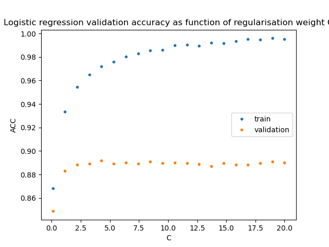
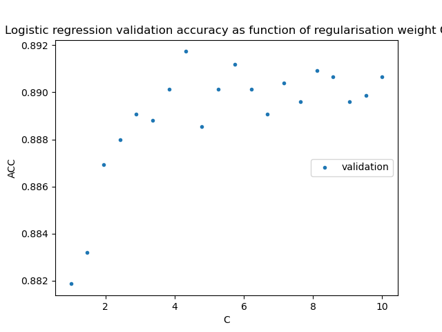
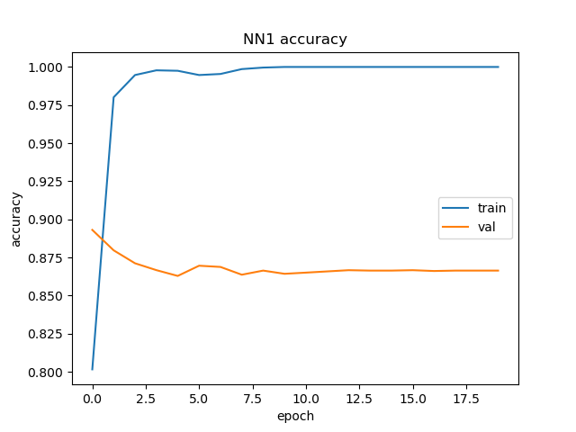
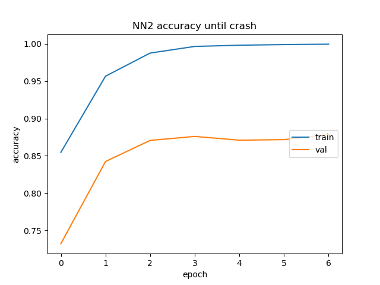

# Machine Learning Miniproject 2: IMDB movie review sentiment classification
Antonin Reh (https://github.com/Ton201), 2025

## Introduction
The dataset under consideration contains a total of 50,000 movie reviews
obtained from the Internet Movie Database. These reviews have been divided into two
distinct sets: a training set comprising 25,000 reviews and a testing set consisting of the
remaining 25,000 reviews. It is noteworthy that the reviews are not uniformly distributed
across the entire spectrum of sentiment; rather, they are dichotomous in nature, with
half of the reviews expressing positive sentiments and the other half expressing
negative sentiments.

### Tasks
1) In this exercise, you will construct three distinct machine learning models
for sentiment classification using the provided dataset. As a machine learning expert,
your objective is to identify suitable methods and evaluate their performance to achieve
optimal results. You are permitted to utilize any model introduced during the course, in
addition to approaches not covered that you deem applicable to your research. These
may include traditional methods and deep neural networks (DNNs) with fine-tuning.
Examples of such methods include CNNs, RNNs, Transformers architectures, Random
Forests, Naïve Bayes, and SVM.

2) Compare and visualize the learning curves and performance of the three
models.

3) Write a scientific report which includes
• Introduction (what is the problem you are solving?)
• Data processing (what are the choices you made in data processing and how
you performed it?)
• Modelling (What are the modeling approaches? How have you performed
them? Why do you think one model performed better than the other one? What
can be done better? Can achieve over 80% accuracy?)
• Conclusions (what were the “scientific” bottlenecks? How did you overcome
them? What is the result you obtained with your best model? Etc..)

## Data processing

We were tasked to use Hugging face dataset tool. However I encountered some problems trying to download the library. Therefore I downloaded the dataset from Kaggle (https://www.kaggle.com/datasets/lakshmi25npathi/imdb-dataset-of-50k-movie-reviews/data).
   The dataset was split according to the assignment requirements in 50/50 ratio into training and testing sets. Trainnin set was further devided into the defacto training set and validation set for purposes of hyperparameter tuning and selection of best performing model. Testing set is left out souly for purpose of generalisation error estimation.

### Feature engineering

For feature engineering, the Term Frequency Inverse Document Frequency (TF-IDF) method was used. It was decided to use this method for it better capability to limit affects of irrelevant words in comparison with the bag of words approach. The TF-IDF method trained on the training set. Transformation method with set parameters was then used for validation and testing set transformation.

Table 1: Size of training, validation and test sets.

| subset     | number of datapoints |
|------------|:--------------------:|
| training   |         21250        |
| validation |         3750         |
| test       |         25000        |

## Modeling and evaluation

### Naive Bayes clasifier

The first model taking into consideration was Naive Bayes clasifier, since it is a simple model a this task is its model use case. Since this model does not have any hyperparameters I decided, there was no tuning required. Representation of both classes in the training set was ballanced with **10579 positive reiews** and **10671 negative reviews**. Obtained trainning accuracy was 0.9140 and **validation accuracy** was **0.8509**.

### Logistic Regression
Second model I am going to try is logistic regression because it is quite powerful clasification model. It is a bit more complex than naive bayes clasifier and requires more tuning. In the first step I am going to try several regularisations to see which produces best performing model.
It was decided to experiment with logistic regresion for its great clasification power with bringing in little hyperparameters to tune. Therefore providing good performance/complexity ratio. The first step was to try several regularisations to see which produces best performing model. However, usage of L1 metric did lead to slight decrease in performamceeven the combination of L1 and L2 metric (so called elastic net regularistion) did not outperform L2 regularised model. In addition to that L2 regularised Logistic reqresion with default Limited-memory Broyden–Fletcher–Goldfarb–Shanno ("lbfgs") sover was by far the fastest learning model. Therefore only the default solver and regualristion (penalty) were taken into consideration for further tuning.
 
Next step was the tuning of regularisation parameter weight. Several screenings were performed in incrementally narrowing range of values. The optimal regularisation weight **C** was approximately **4.316** with coresponding validation accuracy **0.8917**. Graphical ilustration of the training process can be seen in fig. 1 and 2.

### Artificail neural network
Last modelling approach taken into a count was Artificail neural networs. These models are well known for being able to capture complex patterns in data. Which makes them ideal for this task. However, this power comes with several drawbacks such as vast amount of hyperparameters as well as high risk of overfitting.
 
The second mentioned one proved to be the biggest obstacle in this task. Despite the drop out, it reached the training accuracy of 1.00 after 10 epochs, with underperforming validation accuracy of 0.8643. Graphical ilustration of the training process can be seen in fig. 4.

 
The second NN model was modified to accomodate for this problem. Modification were as follows:
• Decreased number of layers (less complex model)
• Added **Batch Normalisation** after every layer (helps to accomodate for complexity of partial derivatives in backward pass)
• Added **Dropout** after every layer

Despite modfication the second model reachedthe trainning accuracy of 0.9995 after 6 epochs, than the training cycle expirienced a crash. Obtaine validation accuracy after 10 epochs was 0.8717. The result was worse than the logistic regression model with added complexity and potential of overfitting. Therefore NN exploration ended in this step. Graphical ilustration of the training process can be seen in fig. 4.

## Coclusions
The best performing model was tuned Logistic Regression. Full comparinson of the model perfomances can be seen in table 2. This modle was used on testing set resulting in test accuracy of 0.8962 which is an excelent result as far as generalisation is concerened. The goal of this assignement was to obtain accuracy of at least 0.85. This goal was fullfilled. Model perfomance did not change significantly in comparison with validation. The model is not overfitted and most likely used all the pottential of provided data. However, the performance could be possibly further improved with more data preparation. Examples could be filtering html tags from raw texts, removing stop words custom stip words or tuning the maximal and minimum uccurence counts. Maybe experiment with possiblity of using two consecutive words as tokens could add more informative value that could be than levared by more complex models such as NN. This would however require  more cumputational power. NN models were overall underperforming in this task. With more time and resources the NN model could be most likely improved.

Table 2: Comparison of model performances.

| model       | trainning accuracy | validation accuracy | Test accuracy |
|-------------|:--------------------:|:--------------------:|:--------------:|
| Naive Bayes |         0.9140     |         0.8509     |xxxxxxxxxxxxxx|
| Logistic    |         0.9721     |         **0.8917**     |    **0.8962**    |
| NN          |         0.9995     |         0.8717     |xxxxxxxxxxxxxx|